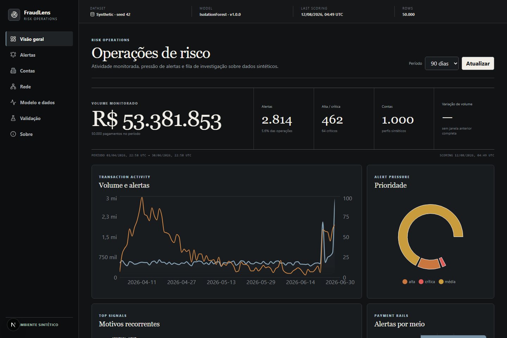
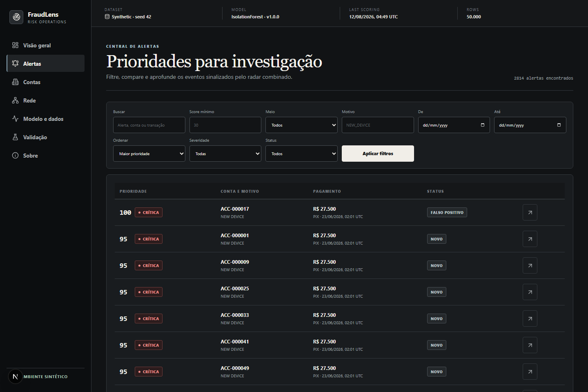
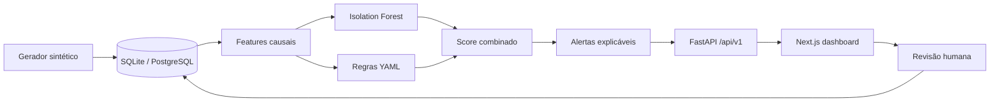

<div align="center">

# FraudLens

### Intelligent Payment Anomaly Radar

**Do pagamento ao sinal. Do sinal à explicação.**

[](https://github.com/GabrielBuck/fraudlens/actions/workflows/backend-ci.yml)
[](https://github.com/GabrielBuck/fraudlens/actions/workflows/frontend-ci.yml)
[](https://github.com/GabrielBuck/fraudlens/actions/workflows/security.yml)
[](https://github.com/GabrielBuck/fraudlens/actions/workflows/docker-ci.yml)
[](LICENSE)

</div>



> Uma plataforma full stack para geração, detecção, explicação e investigação visual de anomalias em pagamentos digitais totalmente sintéticos.

**Snapshot sintético medido:** 1.000 contas · 50.000 transações · recall 93% · PR-AUC 0,8523 · 2.814 alertas. Os resultados não representam desempenho em produção.

[Arquitetura](docs/ARCHITECTURE.md) · [Resultados](docs/PERFORMANCE.md) · [Portfolio pack](docs/portfolio/README.md) · [Model card](docs/MODEL_CARD.md) · [Segurança](SECURITY.md)

## O problema

Uma lista de scores pouco ajuda um analista a decidir. Investigações de risco precisam conectar volume, comportamento histórico, contexto de acesso, regras acionadas e eventos próximos — mantendo claro que um sinal não é prova de fraude.

## A solução

FraudLens gera contas e pagamentos fictícios, injeta oito cenários controlados, calcula features estritamente históricas, treina um `IsolationForest`, executa regras configuráveis e combina os componentes em uma prioridade de 0 a 100. Cada alerta oferece evidências rastreáveis e permite registrar a decisão humana.

## Funcionalidades

- Gerador determinístico de contas, contrapartes, dispositivos, autenticações e transações.
- Oito cenários sintéticos: tomada de conta, velocidade, fracionamento, viagem incompatível, duplicidade, horário/valor atípicos, teste de baixo valor e contraparte de risco.
- 40 features temporais, comportamentais, relacionais, geográficas e de velocidade, sem olhar o futuro.
- `IsolationForest` reproduzível e motor de 13 regras em YAML.
- Score transparente: 55% modelo + 45% regras + intensificadores contextuais.
- Explicações determinísticas em português, sem linguagem acusatória.
- API FastAPI versionada, paginação, filtros, erros padronizados e Swagger.
- Dashboard responsivo com overview, alertas, casos, conta, rede, modelo e laboratório.
- Revisão de alertas e registro de feedback.
- SQLite por padrão e PostgreSQL opcional via perfil Docker.
- Testes, CI, auditoria de dependências, CodeQL e documentação de segurança.

## Demonstração



O fluxo principal permite partir do KPI executivo, filtrar alertas, entender a composição do score, navegar para o histórico da conta e registrar uma classificação. O painel de modelo apresenta métricas somente no contexto sintético.

## Arquitetura



É um monólito modular: simples para executar e discutir em entrevistas, com limites claros entre dados, detecção, serviços, API e interface. Detalhes e trade-offs estão em [docs/ARCHITECTURE.md](docs/ARCHITECTURE.md).

## Stack

| Área | Tecnologias |
|---|---|
| Backend | Python 3.12, FastAPI, Pydantic, SQLAlchemy, Alembic, Typer |
| Dados/ML | pandas, NumPy, scikit-learn, joblib, YAML |
| Frontend | Next.js 16, React 19, TypeScript strict, Tailwind CSS, Recharts, React Flow |
| Persistência | SQLite; PostgreSQL opcional |
| Qualidade | Ruff, mypy, pytest, coverage, ESLint, Vitest, Playwright |
| Infra | Docker Compose, Makefile, GitHub Actions, Dependabot, CodeQL |

## Como executar

### Docker Compose

```bash
cp .env.example .env
docker compose up --build
```

- Dashboard: `http://localhost:3000`
- API: `http://localhost:8000`
- Swagger: `http://localhost:8000/docs`

O modo Docker inicializa migrações e cria uma base de demonstração apenas quando o volume persistente está vazio. Para ativar PostgreSQL: `docker compose --profile postgres up --build` e ajuste `DATABASE_URL`.

Docker não estava disponível no ambiente local original de desenvolvimento. Posteriormente, o GitHub Actions validou a configuração do Compose, os builds das imagens de backend e frontend e um smoke test dos dois serviços. Essa validação não constitui benchmark de performance em containers.

### Execução local — Windows

```powershell
.\scripts\setup.ps1
Set-Location backend
..\.venv\Scripts\python.exe -m app.cli db init
..\.venv\Scripts\python.exe -m app.cli pipeline run-all --accounts 120 --transactions 5000 --seed 42
..\.venv\Scripts\python.exe -m uvicorn app.main:app --reload
```

Em outro terminal:

```powershell
Set-Location frontend
npm run dev
```

### macOS/Linux

```bash
./scripts/setup.sh
cd backend
../.venv/bin/python -m app.cli pipeline run-all --accounts 120 --transactions 5000 --seed 42
../.venv/bin/python -m uvicorn app.main:app --reload
```

Em outro terminal: `cd frontend && npm run dev`.

### Base completa sugerida

```bash
python scripts/generate_data.py --accounts 1000 --transactions 50000 --seed 42
python scripts/train_model.py
python scripts/score_transactions.py
```

Ou use `fraudlens pipeline run-all --accounts 1000 --transactions 50000 --seed 42`.

## Pipeline de dados

1. Geração determinística e integralmente fictícia.
2. Ordenação por conta, timestamp e identificador.
3. Features com `shift`, janelas fechadas à esquerda e estado histórico incremental.
4. Treino não supervisionado; rótulos ficam fora da matriz.
5. Transformação do score bruto entre os percentis 1 e 99 da referência.
6. Regras independentes e normalizadas.
7. Combinação, severidade, explicação e persistência.
8. Métricas calculadas depois do scoring, usando rótulo apenas para avaliação.

## Metodologia de detecção

`IsolationForest` aprende regiões de baixa densidade no espaço multivariado. Seu score não é probabilidade. O motor de regras captura condições legíveis como dispositivo novo, valor atípico, velocidade e deslocamento incompatível. A fórmula padrão é:

```text
risco = clamp(modelo × 0,55 + regras × 0,45 + intensificador, 0, 100)
```

Faixas: `0–29 baixa`, `30–59 média`, `60–79 alta`, `80–100 crítica`. Para evitar uma fila baseada apenas em sinais fracos, a persistência exige também score de regras ≥ 18 ou score isolado do modelo ≥ 95. Pesos e limites estão em `backend/config/detection.yaml`.

## Explicabilidade

Cada alerta mantém score do modelo, score das regras, regras acionadas, valores observados e esperados e explicação textual determinística. O texto usa “comportamento atípico” e “requer investigação”; não acusa pessoas nem afirma intenção.

## Métricas

Precision, recall, F1, PR-AUC, Precision@K, Recall@K, matriz de confusão, recall por cenário, taxa de alertas e falso positivo são persistidos por execução. Resultados medidos estão em [docs/PERFORMANCE.md](docs/PERFORMANCE.md) e no dashboard. Eles não representam desempenho bancário real.

## Estrutura

```text
backend/        API, banco, pipeline e testes
frontend/       dashboard Next.js, testes e screenshots
data/samples/   pequena amostra sintética versionável
docs/           arquitetura, modelo, segurança e material de portfólio
scripts/        setup e entradas diretas do pipeline
.github/        CI, segurança e governança
```

## Testes e qualidade

```bash
make lint
make typecheck
make test
make security
make build
```

Em Windows sem `make`, execute os scripts equivalentes de `backend/pyproject.toml` e `frontend/package.json`, conforme a seção de execução.

## Segurança e privacidade

- Nenhum CPF, CNPJ, nome, endereço ou transação real.
- CORS restrito, payloads validados, paginação limitada e queries parametrizadas.
- Headers de segurança, correlation ID, logs estruturados e rate limit demonstrativo.
- Administração desabilitada por padrão e token apenas via ambiente.
- Modelo carregado somente do artefato local gerado pelo próprio pipeline.

Veja [SECURITY.md](SECURITY.md) e [docs/THREAT_MODEL.md](docs/THREAT_MODEL.md).

## Limitações

- Dados sintéticos são mais limpos e controláveis que dados reais.
- Isolation Forest e limiares não foram calibrados para produção.
- SQLite atende à demonstração, não à concorrência de uma operação real.
- Rate limiting é local ao processo e não distribuído.
- Não há autenticação corporativa, streaming, bloqueio ou integração bancária.
- Feedback é persistido, mas ainda não realimenta treinamento.

## Roadmap

- Validação temporal e calibração com governança formal.
- Model registry e validação de assinatura de artefatos.
- Drift por feature e comparação entre versões.
- Controle de acesso por função e trilha de auditoria imutável.
- Processamento assíncrono e armazenamento analítico em escala.
- Aprendizado ativo a partir de feedback revisado.

## Governança

Contribuições seguem [CONTRIBUTING.md](CONTRIBUTING.md) e [CODE_OF_CONDUCT.md](CODE_OF_CONDUCT.md). O projeto usa licença [MIT](LICENSE).

## Autoria

Projeto de portfólio desenvolvido por [GabrielBuck](https://github.com/GabrielBuck).

## English summary

FraudLens is a reproducible full-stack portfolio project for explainable anomaly investigation in synthetic payments. It combines causal feature engineering, an unsupervised Isolation Forest, configurable rules, a versioned FastAPI backend, and a polished Next.js dashboard. All records and labels are synthetic; scores prioritize human review and must not be interpreted as fraud probabilities or evidence.
