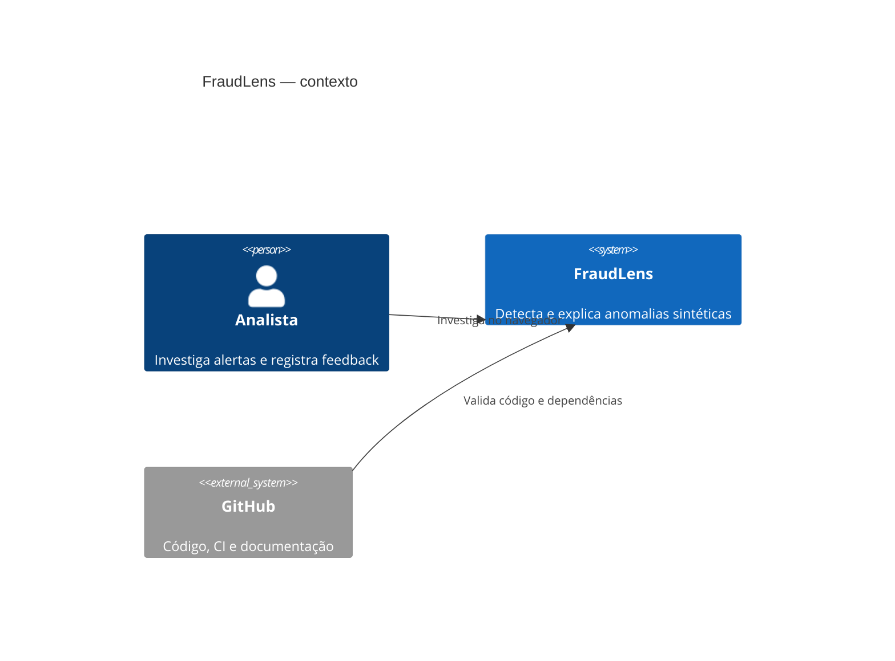
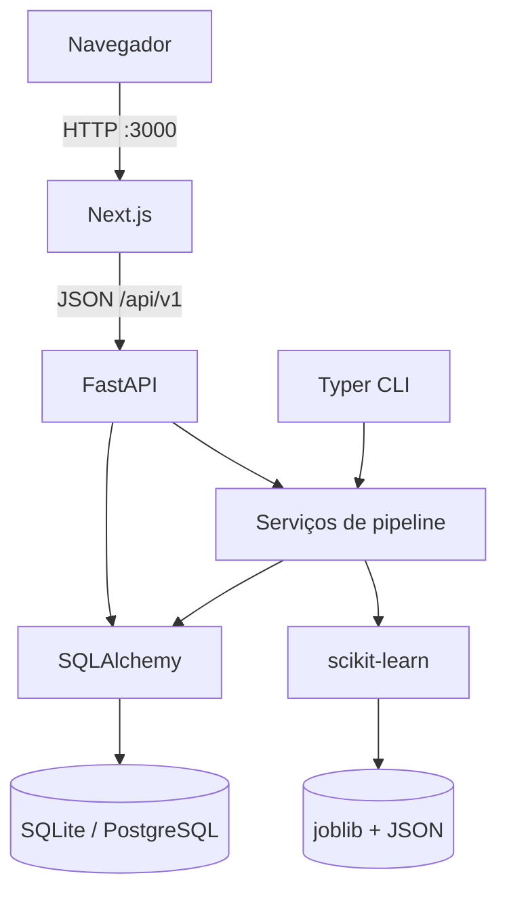
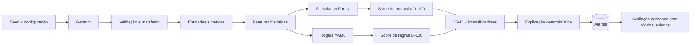
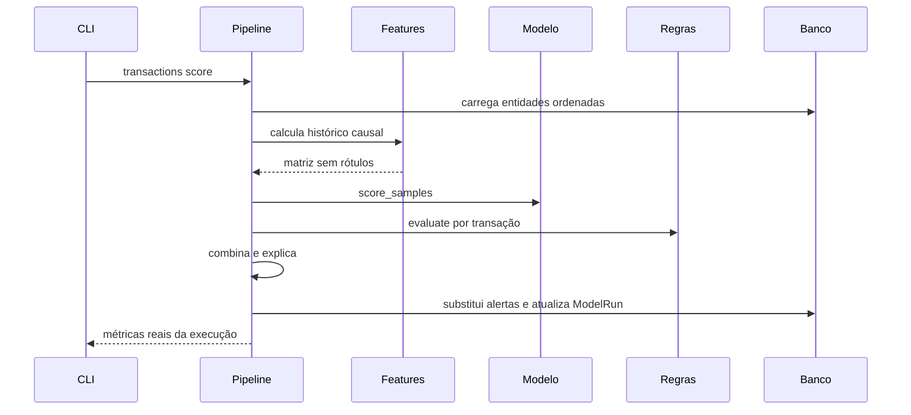
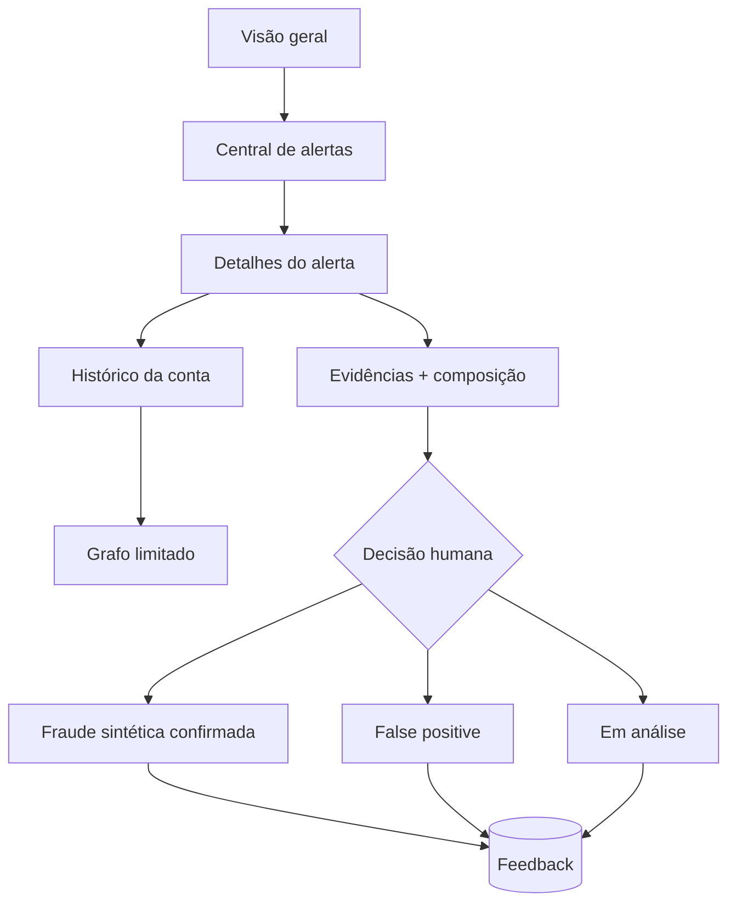

# Arquitetura

## Visão geral

FraudLens é um monólito modular com duas aplicações: uma API/pipeline Python e um console Next.js. SQLite reduz a barreira local; SQLAlchemy mantém a opção PostgreSQL. O design favorece rastreabilidade, reprodução e limites técnicos verificáveis.

## Contexto

## Containers

## Pipeline

## Sequência de scoring

## Fluxo de investigação

## Banco e índices

As tabelas são `accounts`, `counterparties`, `devices`, `authentication_events`, `transactions`, `alerts`, `model_runs`, `dataset_manifests` e `alert_feedback`. Índices compostos cobrem conta/tempo, método/tempo, severidade/score e status/criação. Evidências, métricas e relatórios de qualidade usam JSON por serem documentos derivados dentro do alerta ou da execução.

## Fronteiras de operação e avaliação

`synthetic_ground_truth` e `synthetic_scenario` existem apenas na persistência e no pipeline de avaliação. Schemas Pydantic operacionais selecionam campos explicitamente e impedem que esses labels cheguem às transações, alertas, timelines ou telas de investigação. A superfície de avaliação publica somente manifesto, proveniência e métricas agregadas.

## API

Rotas públicas ficam em `/api/v1`; `/health`, `/docs` e `/redoc` são metadados operacionais. Erros de domínio seguem `{error: {code, message, details, correlation_id}}`. Paginação tem limite 100. Endpoints administrativos existem, mas respondem como indisponíveis até `ENABLE_ADMIN_API=true` e exigem comparação constante do token de ambiente.

## Frontend

O App Router renderiza dados no servidor para a primeira carga. Mutações de revisão são client-side. Recharts atende séries e distribuições; React Flow limita e explora a rede. Componentes comunicam severidade com texto e cor, preservam foco visível e respeitam redução de movimento.

## Decisões e trade-offs

- **Monólito modular em vez de microserviços:** menor custo operacional e melhor demonstrabilidade; módulos permitem futura extração.
- **SQLite padrão:** execução em um comando; PostgreSQL é perfil opcional para discutir concorrência.
- **Batch em vez de streaming:** reprodução determinística e local; produção exigiria eventos, idempotência e filas.
- **Features calculadas em pandas:** transparência; alto volume exigiria SQL/warehouse ou engine distribuída.
- **Joblib local:** suficiente para artefato gerado localmente; produção exige registry, assinatura e armazenamento imutável.
- **Explicação por template:** auditável e offline; um LLM seria apenas enriquecimento controlado, nunca requisito.

## Alternativas rejeitadas

Não foram adotados Kafka, Kubernetes, feature store, autenticação corporativa ou APIs de IA porque adicionariam complexidade sem melhorar o objetivo do MVP. Um modelo supervisionado foi rejeitado por não haver rótulos reais; os rótulos sintéticos permanecem exclusivos da avaliação.

## Evolução para produção

Separar ingestão e scoring, materializar features com contratos, adicionar autenticação e RBAC, assinar artefatos, criar auditoria append-only, calibrar limiares temporalmente, testar fairness com base legal adequada, implantar rate limit distribuído e observabilidade OpenTelemetry.
